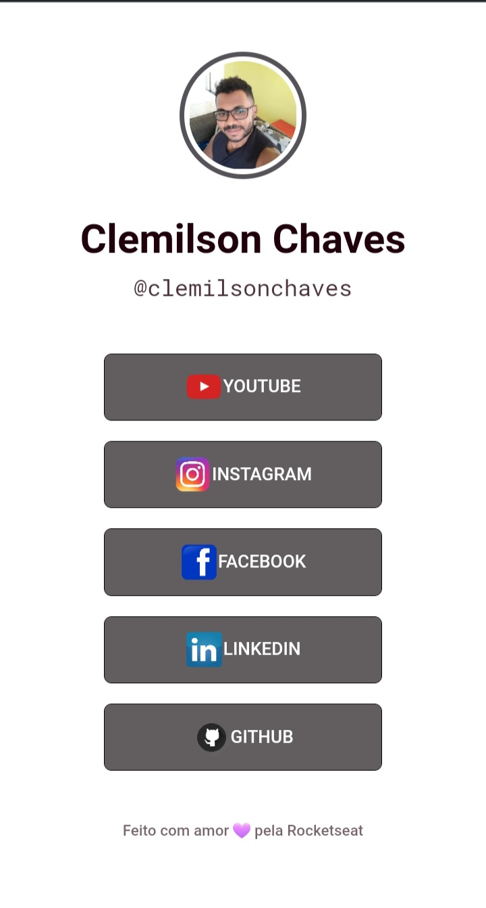

<h1 align="center"> APP de Links para Rede Sociais </h1>

Programa gratuito promovido pela Rocketseat.

  <a href="#-tecnologias">Tecnologias</a>&nbsp;&nbsp;&nbsp;|&nbsp;&nbsp;&nbsp;
  <a href="#-projeto">Projeto</a>&nbsp;&nbsp;&nbsp;|&nbsp;&nbsp;&nbsp;
  <a href="#-layout">Layout</a>&nbsp;&nbsp;&nbsp;|&nbsp;&nbsp;&nbsp;
  

 

   

## 🚀 Tecnologias

Esse projeto foi desenvolvido com as seguintes tecnologias:

- HTML  
- CSS
- GIT  
- GITHUB
## 💻 Projeto

O APP Link sociais e um app que tem todos os links das redes sociais escolhidas.

- [visite o projeto online] (https://clemilsonchaves.github.io/links-sociais)

   
